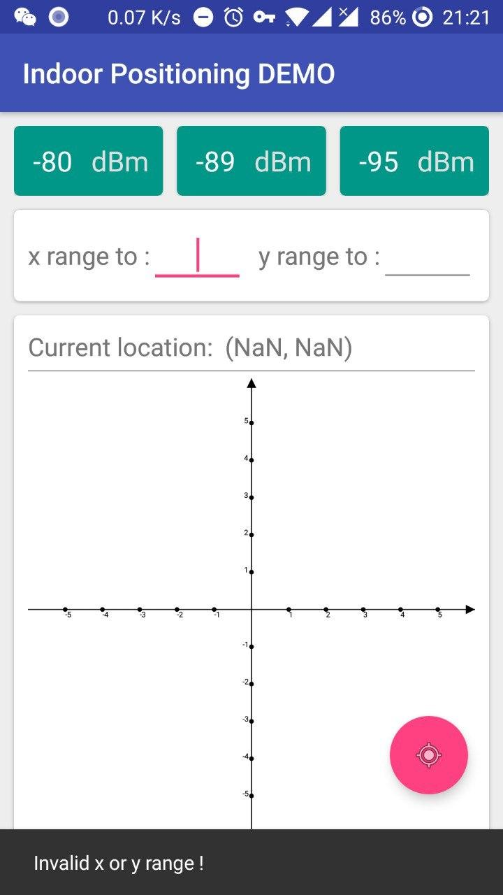
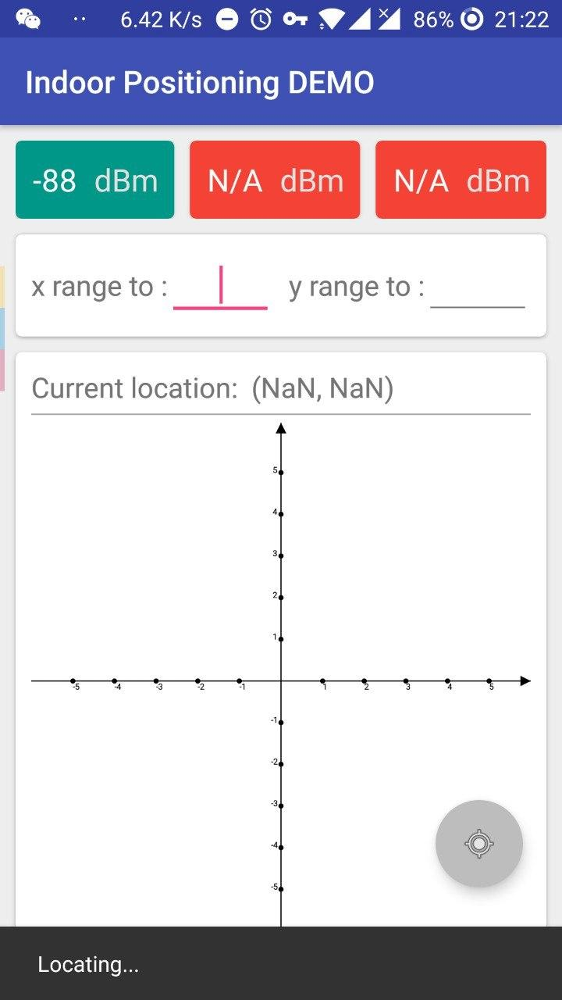
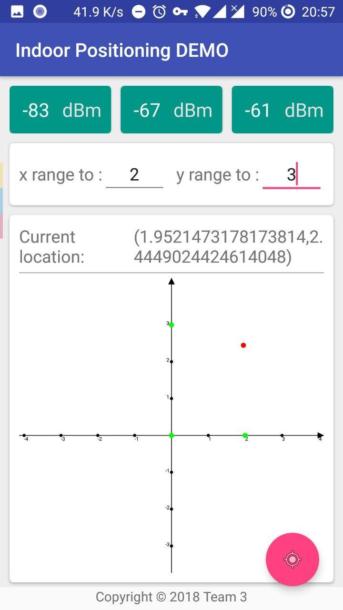

# Indoor Positioning DEMO

物联网工程应用实践 NUAA Spring 2018

## Introduction

室内定位的软件，只能依靠特定基站使用。

> 仅在指定 Testbed 测试通过。

## Screenshots

## Copyright

Copyright &copy; 2018 Team 3

## Acknowledge

Greatest thanks to [FlyAndNotDown/BluetoothLocation](https://github.com/FlyAndNotDown/BluetoothLocation) !